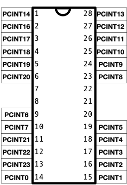
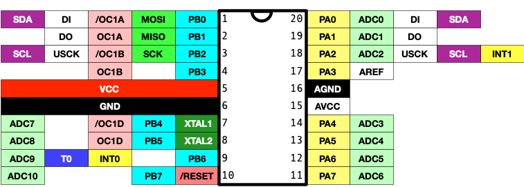
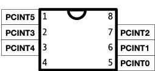

# AVRメモ帳

Arduinoについては[Arduinoのメモ帳](https://github.com/mamemomonga/notebook-arduino)参照

* [コード集1(整理中)](./src)
* [コード集2(整理中)](./avr)
* [クロックについて](./clock)
* [開発情報](./development)

# 開発

* [Atmel Studio](https://www.microchip.com/mplab/avr-support/atmel-studio-7)
* [CrossPack for AVR](https://www.obdev.at/products/crosspack/index.html)

# プログラミング環境とライブラリ

* [LUFA](http://www.fourwalledcubicle.com/LUFA.php)
* [AVRDUDE](http://www.nongnu.org/avrdude/)
* [dfu-programmer](https://dfu-programmer.github.io)

# 便利なツール

* [Engbedded Atmel AVR® Fuse Calculator](http://www.engbedded.com/fusecalc)
* [AVR UART Baud Rate Calculator](https://trolsoft.ru/en/uart-calc)
* [AVR Makefile Generator](https://0xdec.gitlab.io/avr-makefile-generator/)

# よく使うIC

 名前 | PGM | SRAM | EEPROM | 単価 | 特徴
------|---- |------|--------|------|----------
[ATTiny10A]() | 1K | 32 | - | [秋月:35円](http://akizukidenshi.com/catalog/g/gI-04575/) | 米粒大
[ATTiny13A](https://www.microchip.com/wwwproducts/en/ATTINY13A) | 1K | 64 | 64 | [秋月:50円](http://akizukidenshi.com/catalog/g/gI-02911/) | 好き
[ATTiny85](https://www.microchip.com/wwwproducts/en/ATtiny85) | 8K | 512 | 512 | [秋月:130円](http://akizukidenshi.com/catalog/g/gI-09573/) | SPI,I2C,SPWM
[ATtiny461A](https://www.microchip.com/wwwproducts/en/ATtiny461A) | 5K | 256 | 256 | [RS(PDIP): 145円](https://jp.rs-online.com/web/p/microcontrollers/1331652P/), [RS(TSSOP): 47.6円](https://jp.rs-online.com/web/p/microcontrollers/1331654/) | 20ピン、TSSOPなら50円程度。温度センサー内蔵
[ATmega48](https://www.microchip.com/wwwproducts/en/ATmega48) | 4K | 512 | 256 | [秋月:150円](http://akizukidenshi.com/catalog/g/gI-08437/) | 面実装だけど安い
[ATmega168](https://www.microchip.com/wwwproducts/en/ATmega168) | 16K | 1K | 512 |[RS:330.5円](https://jp.rs-online.com/web/p/microcontrollers/1278258/) | 機能は多分328Pとほとんど同じ
[ATmega328P](https://www.microchip.com/wwwproducts/en/ATmega328P) | 32K | 2K | 1K | [秋月:230円](http://akizukidenshi.com/catalog/g/gI-03142/) | Arduino UNOの本体
[ATmega88V](https://www.microchip.com/wwwproducts/en/ATmega88) | 8K | 1K | 512 | [秋月:260円](http://akizukidenshi.com/catalog/g/gI-03655/) | 1.8Vから動く、最大10MHz
[AT90USB162](https://www.microchip.com/wwwproducts/en/AT90USB162) | 16K | 512 | 512 | [RS:312円](jp.rs-online.com/web/p/microcontrollers/1278165/) | USB
[ATmega32U2](https://www.microchip.com/wwwproducts/en/ATmega32U2) | 32K | 1024 | 1024 | [RS:346円](https://jp.rs-online.com/web/p/microcontrollers/1310287/) | USB
[ATmega32U4](https://www.microchip.com/wwwproducts/en/ATmega32U4) | 32K | 1K | 2.5K | [RS:477円](https://jp.rs-online.com/web/p/microcontrollers/1310289/) | USB、Arduino Micro, Leonardoの本体

# ピンアサイン

* 電源電圧・最大クロック周波数はモデルによって異なりますが、細かな周波数にこだわらないなら(USARTなどに影響する) **5Vなら16MHz、3.3Vなら10MHz** で問題ないようです。
* AVRISP2の接続する部分には低インピーダンスの負荷をつなげないようにする必要があります。
* VCCとGNDの間には0.1uFのコンデンサをできるだけ短い距離で接続します。

## ATmega168P, 328P (28PDIP)

PCINT

Arduinoの場合のピンアサイン

## ATtiny461A (20PDIP)

## ATtiny 13A (8PDIP)

PCINT

## ATTiny 10 (SOT23)

PCINT

## AVRISP mk2 コネクタ
ボード側のピンを上から見た配置、コネクタの裏側からみた配置です。

SCK, MISO, MOSIが一列、VCC,GND,RSTを自由にできるコネクタをつくるとブレッドボードで利用できるので大変便利です。

## ATmega48 TQFP

ET-PCB TQFP32

