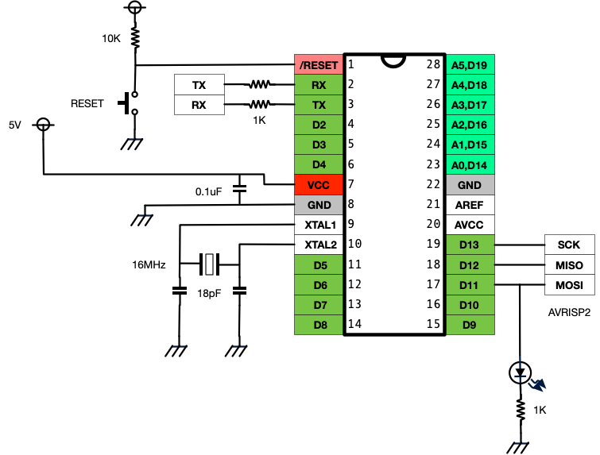
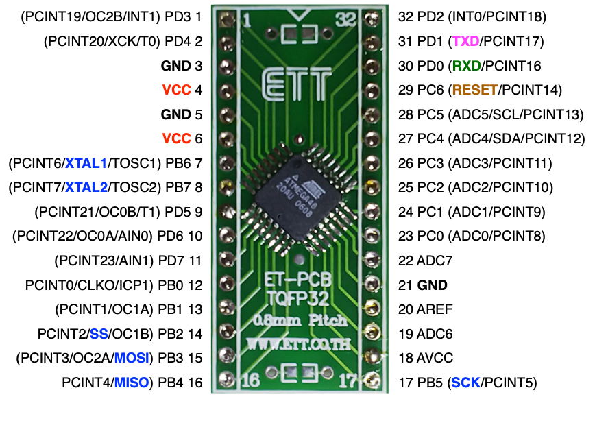

# ピンレイアウトと配線サンプル

* 電源電圧・最大クロック周波数はモデルによって異なるが、細かな周波数にこだわらないなら(USARTなどに影響する) **5Vなら16MHz、3.3Vなら10MHz** で問題なし。
* AVRISP2の接続する部分には低インピーダンスの負荷をつなげない。
* VCCとGNDの間には0.1uFのコンデンサをできるだけ短い距離で接続する。

## ATmega168, 328P (28PDIP)

PCINT

Arduinoの場合のピンアサイン

## ATtiny 13A (8PDIP)

PCINT

## ATTiny 10 (SOT23)

PCINT

## AVRISP mk2 コネクタ
ボード側のピンを上から見た配置、コネクタの裏側からみた配置です。

SCK, MISO, MOSIが一列、VCC,GND,RSTを自由にできるコネクタをつくるとブレッドボードで利用できるので大変便利です。

## ATmega48 TQFP

ET-PCB TQFP32

